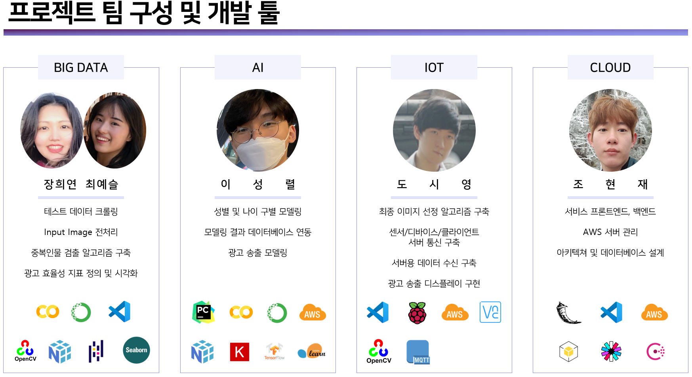
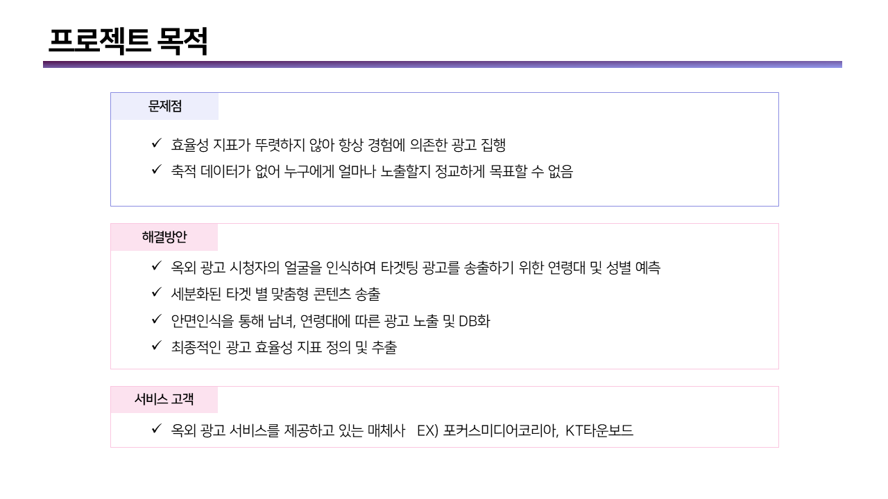
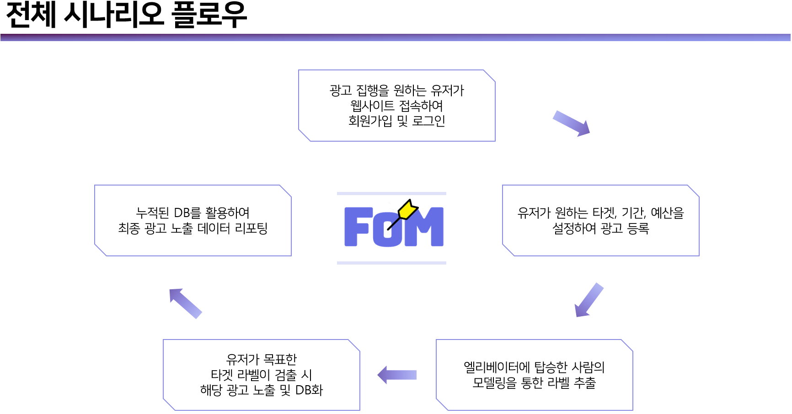
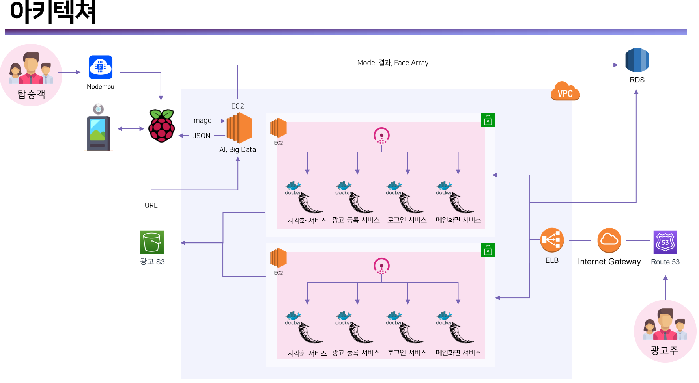

# IoT

전체 프로젝트에서 IoT가 담당하는 Input, Output, 디바이스 통신 및 클라이언트와 서버통신 부분입니다.

탑승객의 움직임이 센서에 의해 감지되면 MQTT를 통해 Broker에게 센서값이 전송되며 센서값에 따라 Camera가 작동됩니다. 작동되는 시간동안 최다 얼굴 검출된 이미지를 AWS EC2에 전송하여 전처리를 실행합니다.

Broker는 전처리된 데이터를 기반으로 AWS EC2에서 Key와 ID를 받으며 해당 Key를 이용하여 AWS S3에 접속 후 광고 영상을 다운로드 및 영상 송출을 하게 됩니다.

[도메인](http://focuson-me.site) 을 구입하여 서비스 완성을 하였고 전체적인 완성부분은 밑에 영상파일과 PPT파일과 시연 영상을 참고해주세요.

▶ Tool

- Language : Python, C++
- IDE : VScode
- Library : openCV / Socket / MQTT / Json / Samba 
- Tool : VNC viwer / Puttry / Bitvise SSH

## Collaborators

- Bigdata : [장희연](https://github.com/hiiiiyeon), [최예슬](https://github.com/yschoi9930)
- AI : [이성렬](https://github.com/leesungryul)
- IoT : [도시영](https://github.com/dsy-sw)
- Cloud : [조현재](https://github.com/jaden7856)

### File

참고할 수 있는 파일 모두 git에 올려져 있습니다.

-  PPT file : Focus on Me 포트폴리오.pptx
- 시연 영상 : Focus on Me 시연 영상.mp4
- SRS : Focus on Me - 요구사항정의서.xlsx
- WBS : Focus on Me WBS.xlsx
- Architecture : AD_Architecture.drawio

# 배경

# Architecture

=======